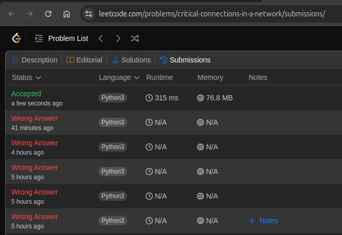

## #1192. Critical Connections in a Network

[Link para a questão](https://leetcode.com/problems/critical-connections-in-a-network/description/)

### Gravação:

[Link para a gravação](https://youtu.be/0bWuPq4nmsI)

#### Dificuldade: Difícil

### Enunciado:

There are n servers numbered from 0 to n - 1 connected by undirected server-to-server connections forming a network where connections[i] = [ai, bi] represents a connection between servers ai and bi. Any server can reach other servers directly or indirectly through the network.

A critical connection is a connection that, if removed, will make some servers unable to reach some other server.

Return all critical connections in the network in any order.

Constraints:

2 <= n <= 105 
n - 1 <= connections.length <= 105 
0 <= ai, bi <= n - 1 
ai != bi 
There are no repeated connections.

#### Exemplo

Input: n = 4, connections = [[0,1],[1,2],[2,0],[1,3]] 
Output: [[1,3]] 
Explanation: [[3,1]] is also accepted.

### Submissões: 

Abaixo se encontra a imagem que mostra as submissoẽs feitas até chegar a resposta

