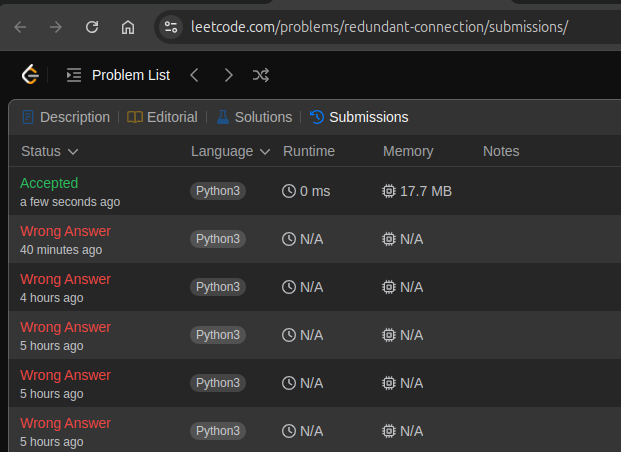

## #684. Redundant Connection

[Link para a questão](https://leetcode.com/problems/redundant-connection/description/)

### Gravação:

[Link para a gravação]()

#### Dificuldade: Média

### Enunciado:

In this problem, a tree is an undirected graph that is connected and has no cycles.

You are given a graph that started as a tree with n nodes labeled from 1 to n, with one additional edge added. The added edge has two different vertices chosen from 1 to n, and was not an edge that already existed. The graph is represented as an array edges of length n where edges[i] = [ai, bi] indicates that there is an edge between nodes ai and bi in the graph.

Return an edge that can be removed so that the resulting graph is a tree of n nodes. If there are multiple answers, return the answer that occurs last in the input.

Constraints:

n == edges.length 
3 <= n <= 1000 
edges[i].length == 2 
1 <= ai < bi <= edges.length 
ai != bi 
There are no repeated edges. 
The given graph is connected.

#### Exemplo

Input: edges = [[1,2],[2,3],[3,4],[1,4],[1,5]] 
Output: [1,4]

### Submissões: 

Abaixo se encontra a imagem que mostra as submissoẽs feitas até chegar a resposta

